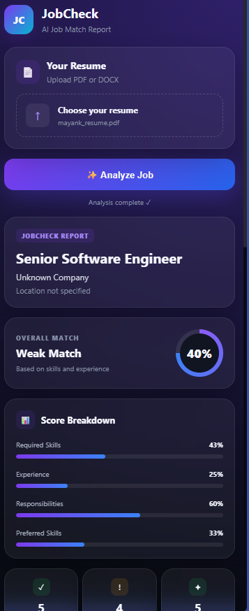

# 🚀 JobCheck

## 📸 Screenshots




**AI-powered job and resume matching assistant for LinkedIn**

JobCheck is a Chrome extension that analyzes a LinkedIn job posting against your resume and generates a concise match report.

It helps you quickly understand:

* 🎯 Overall job match score
* 🛠️ Matching skills
* ❌ Missing skills
* ⚠️ Partial skill matches
* 💼 Experience match
* 📋 Job requirements
* ✏️ Resume improvement actions
* 🟢 Whether the role is worth applying to

JobCheck runs locally on your computer, so you don't need to deploy the backend to use it.

---


## ✨ Features

### 🎯 Job Match Score

Get an overall match score based on:

* Required skills
* Experience
* Job responsibilities
* Preferred skills

Example:

```text
Overall Match
       78%
   Strong Match
```

### 🛠️ Skill Matching

JobCheck separates skills into:

```text
✓ Matching Skills

⚠ Partial Matches

✕ Missing Skills
```

It does not automatically assume that related technologies are identical.

For example:

```text
React ≠ Next.js
JavaScript ≠ TypeScript
REST API ≠ JWT
Python ≠ FastAPI
```

### 💼 Experience Analysis

JobCheck evaluates whether your **professional experience** matches the experience requirement in the job description.

Academic projects, personal projects, hackathons, and coursework are not automatically treated as professional experience.

### 📋 Job Requirement Analysis

The job description is analyzed into:

* Required skills
* Preferred skills
* Experience
* Education
* Background requirements
* Soft skills
* Responsibilities

### ✏️ Resume Actions

JobCheck provides concise suggestions for improving your resume based on the job.

It avoids recommending that you falsely claim experience you don't have.

---

# 🧠 How It Works

```text
┌──────────────────────┐
│   LinkedIn Job       │
└──────────┬───────────┘
           │
           ▼
┌──────────────────────┐
│ Chrome Extension     │
│ Extracts Job Details │
└──────────┬───────────┘
           │
           ▼
┌──────────────────────┐
│ Local FastAPI        │
│ Backend              │
└──────────┬───────────┘
           │
           ├──────────────┐
           ▼              ▼
   Resume Parser       Groq AI
           │              │
           └──────┬───────┘
                  ▼
          Resume ↔ Job Match
                  │
                  ▼
          ┌───────────────┐
          │ Match Report  │
          └───────────────┘
```

---

# 🛠️ Tech Stack

### Frontend

* Chrome Extension
* Manifest V3
* HTML
* CSS
* JavaScript
* Chrome Side Panel API

### Backend

* Python
* FastAPI
* Uvicorn

### AI

* Groq API
* `openai/gpt-oss-120b`

### Resume Processing

* `pypdf`
* `python-docx`

### Tool Layer

* MCP

### Storage

No database is required for the current version.

---

# 📁 Project Structure

```text
JobCheck/
│
├── backend/
│   │
│   ├── app/
│   │   ├── __init__.py
│   │   │
│   │   ├── main.py
│   │   │
│   │   ├── mcp/
│   │   │   ├── __init__.py
│   │   │   ├── server.py
│   │   │   └── tools.py
│   │   │
│   │   └── services/
│   │       ├── __init__.py
│   │       ├── groq_service.py
│   │       ├── job_analyzer.py
│   │       ├── matcher.py
│   │       └── resume_parser.py
│   │
│   ├── requirements.txt
│   ├── .env
│   └── .gitignore
│
└── extension/
    │
    ├── manifest.json
    ├── background.js
    ├── content.js
    │
    ├── sidepanel.html
    ├── sidepanel.css
    ├── sidepanel.js
    │
    ├── popup.html
    ├── popup.css
    ├── popup.js
    │
    └── icons/
        ├── icon16.png
        ├── icon48.png
        ├── icon64.png
        └── icon128.png
```

---

# 💻 Local Installation

## Requirements

Before installing JobCheck, make sure you have:

* Python 3.10+
* Google Chrome
* A Groq API key
* Git (optional)

No PostgreSQL, Docker, or cloud deployment is required.

---

# 1️⃣ Clone the Repository

```bash
git clone https://github.com/Raj-Mayank2/JobCheck.git
cd JobCheck
```

Or download the repository as a ZIP and extract it.

---

# 2️⃣ Set Up the Backend

Open a terminal inside the project:

```bash
cd backend
```

Create a virtual environment:

### Windows PowerShell

```powershell
python -m venv venv
```

Activate it:

```powershell
.\venv\Scripts\Activate.ps1
```

If PowerShell blocks activation, you can use:

```powershell
Set-ExecutionPolicy -ExecutionPolicy RemoteSigned -Scope CurrentUser
```

Then activate again:

```powershell
.\venv\Scripts\Activate.ps1
```

---

# 3️⃣ Install Dependencies

Run:

```powershell
pip install -r requirements.txt
```

---

# 4️⃣ Configure Groq API

JobCheck uses Groq to analyze job descriptions and compare them with resumes.

Create:

```text
backend/.env
```

Add:

```env
GROQ_API_KEY=your_groq_api_key_here
```

Replace:

```text
your_groq_api_key_here
```

with your actual Groq API key.

### Important

Never commit your API key to GitHub.

The `.gitignore` file already excludes:

```text
.env
```

---

# 5️⃣ Start the Backend

Make sure you are inside:

```text
JobCheck/backend
```

with the virtual environment activated.

Run:

```powershell
uvicorn app.main:app --reload
```

You should see something similar to:

```text
Uvicorn running on http://127.0.0.1:8000
```

Keep this terminal running.

---

# 6️⃣ Test the Backend

Open:

```text
http://127.0.0.1:8000/docs
```

You should see the FastAPI Swagger interface.

You can also test:

```text
http://127.0.0.1:8000/health
```

Expected response:

```json
{
  "status": "ok"
}
```

---

# 7️⃣ Install the Chrome Extension

Open Chrome and go to:

```text
chrome://extensions
```

Enable:

```text
Developer mode
```

Then click:

```text
Load unpacked
```

Select:

```text
JobCheck/extension
```

Chrome will install the extension locally.

---

# 8️⃣ Use JobCheck

### Step 1

Open a LinkedIn job posting:

```text
https://www.linkedin.com/jobs/
```

### Step 2

Open the JobCheck extension.

### Step 3

Open the JobCheck side panel.

### Step 4

Upload your resume.

Supported formats:

```text
PDF
DOCX
```

### Step 5

Click:

```text
Analyze Job
```

JobCheck will:

```text
Extract LinkedIn Job
        ↓
Analyze Job Requirements
        ↓
Parse Resume
        ↓
Compare Resume + Job
        ↓
Generate Match Report
```

---

# 📊 Example Report

```text
JOBCheck REPORT

Full Stack Developer
Example Company
Remote

OVERALL MATCH

        78%
    Strong Match


Score Breakdown

Skills             82%
Experience         60%
Responsibilities   80%
Preferred Skills  100%


Skill Match

✓ Matching

React
Python
REST APIs
HTML5


⚠ Partial

Responsive Design


✕ Missing

TypeScript
Next.js
JWT


Experience

Partial match


Resume Actions

• Highlight relevant backend experience
• Quantify impact where applicable
• Make existing API work more visible


Recommendation

🟢 Apply
```

---

# 🔐 Privacy

JobCheck requires your resume to perform the matching analysis.

When you click **Analyze Job**:

```text
Resume
   ↓
Local JobCheck Backend
   ↓
Groq API
   ↓
Analysis
   ↓
Result
```

The current application does not require a database.

Your resume is processed temporarily by the backend for analysis.

### API Key Security

Your Groq API key should remain inside:

```text
backend/.env
```

Never place your Groq API key inside:

```text
extension/
```

Never commit it to GitHub.

---

# ⚠️ Troubleshooting

## "Could not extract job information"

Make sure you are currently viewing a LinkedIn job page.

Try refreshing the page and then opening JobCheck again.

---

## "Please refresh the LinkedIn job page"

Refresh the LinkedIn job page:

```text
Ctrl + R
```

Then reload the JobCheck extension from:

```text
chrome://extensions
```

---

## Backend connection error

Make sure the backend is running:

```powershell
cd backend
.\venv\Scripts\Activate.ps1
uvicorn app.main:app --reload
```

Then verify:

```text
http://127.0.0.1:8000/health
```

---

## Groq API error

Check that:

```text
backend/.env
```

contains:

```env
GROQ_API_KEY=your_actual_key
```

Then restart the backend.

---

## Resume upload error

Currently supported formats are:

```text
.pdf
.docx
```

Make sure the file is not corrupted or password protected.

---

# 🔧 Development

Run the backend:

```powershell
cd backend
.\venv\Scripts\Activate.ps1
uvicorn app.main:app --reload
```

After changing extension files:

```text
chrome://extensions
        ↓
JobCheck
        ↓
Reload
```

---

# 🚀 Deployment

A cloud deployment is **not required**.

The recommended development setup is:

```text
Chrome Extension
       │
       ▼
localhost:8000
       │
       ▼
FastAPI
       │
       ▼
Groq
```

You can optionally deploy the backend later and configure the extension to use the deployed API.

---

# 🧩 MCP

JobCheck includes an MCP tool layer for exposing application capabilities as tools.

Current tools include:

```text
analyze_job_description_tool
match_resume_to_job_tool
```

The MCP layer is designed to keep job analysis and resume matching modular and extensible.

---

# 🛣️ Roadmap

* [x] LinkedIn job extraction
* [x] Resume PDF parsing
* [x] Resume DOCX parsing
* [x] AI job analysis
* [x] Resume/job matching
* [x] Match score
* [x] Skill classification
* [x] Experience analysis
* [x] Chrome Side Panel
* [x] Local installation
* [x] Backend deployment support
* [ ] Better LinkedIn company/location extraction
* [ ] ATS keyword analysis
* [ ] Skill gap prioritization
* [ ] Resume before/after improvements
* [ ] Job red-flag detection
* [ ] Saved job history
* [ ] Compare multiple jobs
* [ ] Chrome Web Store release

---

# 🤝 Contributing

Contributions are welcome.

1. Fork the repository.
2. Create a branch:

```bash
git checkout -b feature/my-feature
```

3. Make your changes.
4. Commit:

```bash
git commit -m "Add my feature"
```

5. Push:

```bash
git push origin feature/my-feature
```

6. Open a Pull Request.

---

# 📄 License

This project is currently provided for educational and development purposes.

---

# ⭐ Support

If you find JobCheck useful, consider giving the repository a ⭐ on GitHub.

**Built with Python, FastAPI, Chrome Extensions, MCP, and Groq.**
